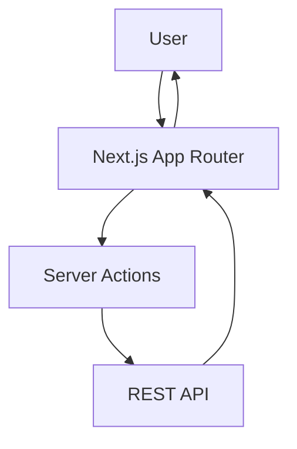
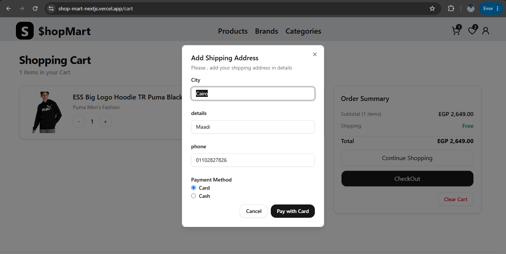

<p align="center">
  
</p>

# ShopMart

<p align="center">
Modern Frontend E-Commerce built with Next.js App Router, TypeScript, Tailwind CSS and NextAuth.
</p>

<p align="center">

<a href="https://shop-mart-nextjs.vercel.app/">

</a>

<a href="https://github.com/abdelrahman-waliid/shop-mart-nextjs">

</a>

</p>

A modern frontend e-commerce experience built with Next.js, TypeScript, and Tailwind CSS, featuring Authentication, Cart, Wishlist, Checkout, and Responsive Design.


  


## Table of Contents

- [Project Overview](#project-overview)
- [Highlights](#highlights)
- [Key Features](#key-features)
- [Tech Stack](#tech-stack)
- [Project Architecture](#project-architecture)
- [Architecture Diagram](#architecture-diagram)
- [Folder Structure](#folder-structure)
- [Installation](#installation)
- [Environment Variables](#environment-variables)
- [Available Scripts](#available-scripts)
- [Screenshots](#screenshots)
- [Responsive Design](#responsive-design)
- [Performance Optimizations](#performance-optimizations)
- [Future Improvements](#future-improvements)
- [Author](#author)
- [License](#license)

## Project Overview

ShopMart is a frontend-only e-commerce application built with Next.js App Router and TypeScript. It showcases a modern frontend architecture with real-world REST API integration, authentication, reusable components, and a responsive UI designed for a polished shopping experience.

## Highlights

- ✔ Authentication with protected routes
- ✔ Fully responsive shopping experience
- ✔ Modular reusable component architecture
- ✔ Server Actions for API communication
- ✔ Type-safe development with TypeScript
- ✔ Modern UI using Tailwind CSS
- ✔ Wishlist and cart management
- ✔ Checkout flow

## Why I Built This Project

This project was built to practice and demonstrate modern frontend development with Next.js App Router, Server Actions, authentication, API integration, state management, responsive design, and a production-ready folder structure.

## Key Features

- Authentication with login, registration, password reset, and protected routes
- Product catalog browsing across products, categories, and brands
- Detailed product views with image galleries, pricing, ratings, and descriptions
- Shopping cart with add, update, remove, clear, and checkout flows
- Wishlist management for saving favorite products
- Checkout experience with shipping details and payment method selection
- Order history for authenticated users
- Responsive UI for mobile and desktop screens
- Form validation and toast notifications for better UX
- Loading and error handling across key user flows

## Tech Stack

| Category | Technologies |
| --- | --- |
| Frontend | Next.js 16, React 19, TypeScript |
| Authentication | NextAuth |
| Styling | Tailwind CSS |
| Forms | React Hook Form, Zod |
| UI | Radix UI, Lucide React, Embla Carousel, react-hot-toast, Next Image |
| State Management | Context API |
| Deployment | Vercel |

## Project Architecture

The application follows a modern Next.js App Router flow with a clear separation between Server Components, Client Components, and Server Actions.

User

↓

App Router

↓

Server Components

↓

Server Actions

↓

REST API

↓

Client Components update the UI

- Server Components handle initial data fetching for products, categories, brands, cart, wishlist, and orders.
- Server Actions manage secure API communication for cart, wishlist, registration, and checkout.
- Client Components handle interactive experiences such as cart updates, wishlist toggles, and checkout dialogs.
- Protected routes are enforced with NextAuth and route-level guards.

## Architecture Diagram



## Folder Structure

```text
src/
  app/              # route pages, layouts, and route groups
  actions/          # server actions for API interactions
  components/       # reusable UI and feature components
  Context/          # wishlist context provider
  Helpers/          # formatting and utility helpers
  Interfaces/       # TypeScript interfaces and response types
  lib/              # shared utilities
  Shema/            # validation schemas
  types/            # NextAuth type augmentation
  assets/           # local assets
  hooks/            # reusable client-side hooks (if added)
  providers/        # shared providers (if added)
  constants/        # shared app constants (if added)
  services/         # API/service layer helpers (if added)
public/             # static assets and screenshots
middleware.ts      # route protection middleware
```

## Installation

```bash
git clone https://github.com/abdelrahman-waliid/shop-mart-nextjs.git
cd shop-mart
npm install
npm run dev
```

Open [http://localhost:3000](http://localhost:3000) to view the application.

## Environment Variables

Create a .env.local file in the project root and add the following values:

```env
# Base API URL
API_URL=https://ecommerce.routemisr.com/api/v1

# Authentication Secret
NEXTAUTH_SECRET=your-nextauth-secret

# Frontend URL
BASE_URL=http://localhost:3000
```

## Available Scripts

```bash
npm run dev      # start the development server
npm run build    # create a production build
npm run start    # run the production build locally
npm run lint     # run ESLint
```

## Screenshots

 
### Home


### Products


### Product Details


### Cart


### Wishlist


### Checkout


## User Flow

Home

↓

Browse Products

↓

Product Details

↓

Add to Cart / Wishlist

↓

Authentication

↓

Checkout

↓

Orders

## Responsive Design

The interface is designed to work smoothly across mobile, tablet, and desktop screens. Navigation adapts between a desktop menu and a mobile dropdown, and product grids shift responsively depending on the viewport size.

## Performance Optimizations

- Server-side rendering where appropriate for key product and catalog pages
- Optimized image loading with Next.js Image
- Route-based code splitting for efficient navigation
- Reusable components to reduce duplication and improve maintainability
- Client components used only where interactivity is required
- Remote image configuration for external product assets

## Future Improvements

- Product search
- Filters and sorting
- Dark mode
- Pagination improvements
- Unit testing
- E2E testing
- Internationalization (i18n)

## What I Learned

- Next.js App Router
- Server Components
- Server Actions
- Authentication
- Form Validation
- API Integration
- Reusable Components
- TypeScript Best Practices

## Author

Name: Abdelrahman Walid

GitHub: [abdelrahman-waliid](https://github.com/abdelrahman-waliid)
Portfolio: Coming Soon
LinkedIn: [LinkedIn](www.linkedin.com/in/abdelrahman-waliid)

## License

This project is licensed under the MIT License.

## Support

If you like this project, consider giving it a ⭐ on GitHub.

---

Built with ❤️ using Next.js and TypeScript.
